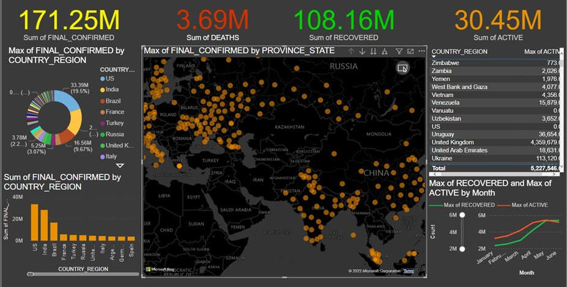
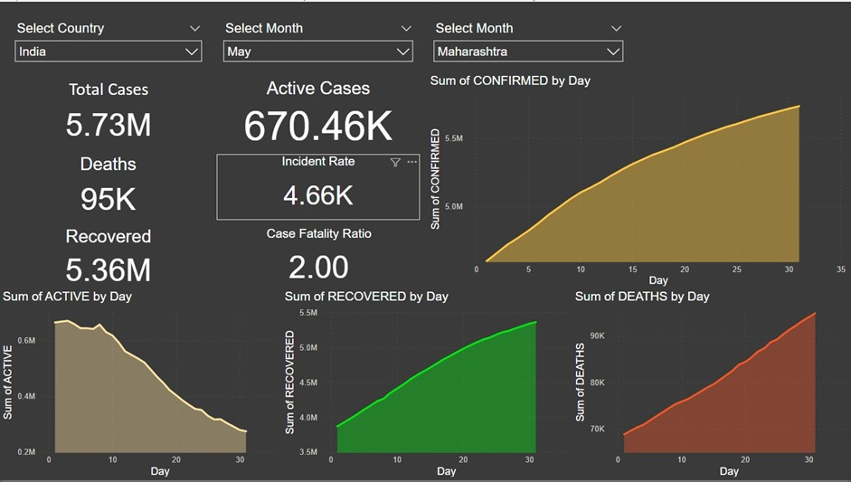
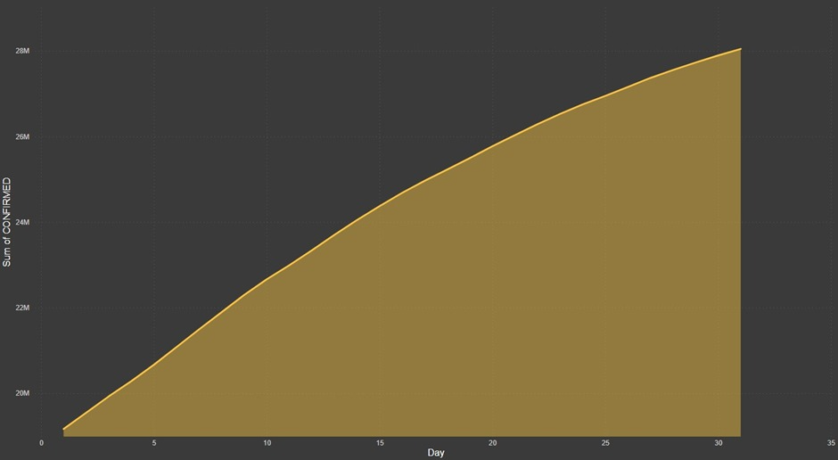
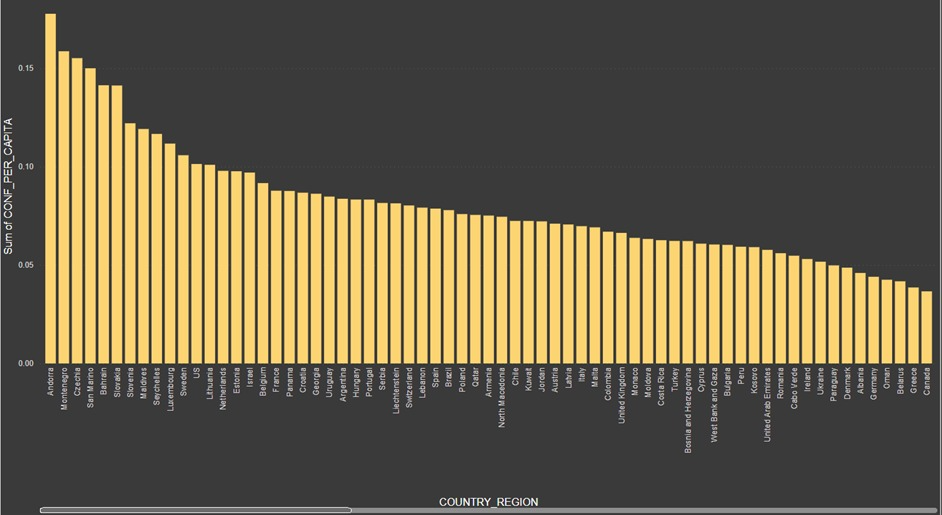
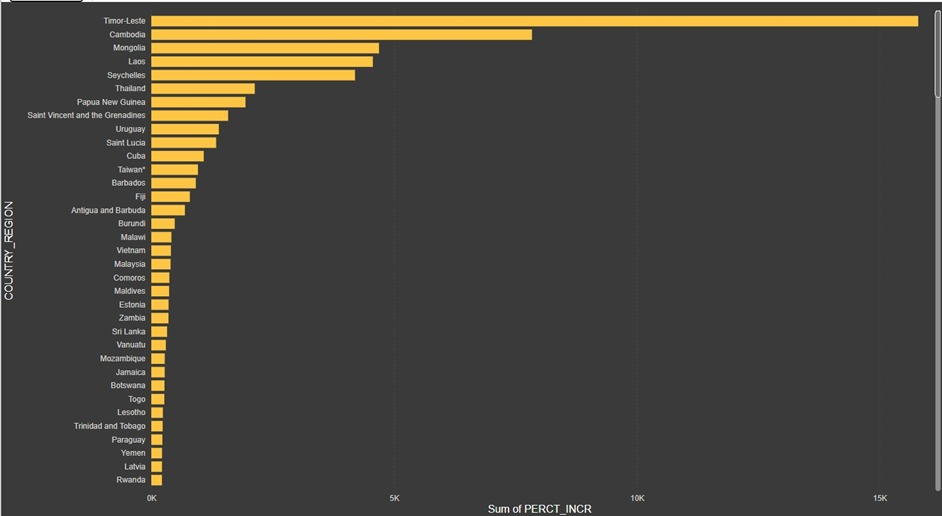
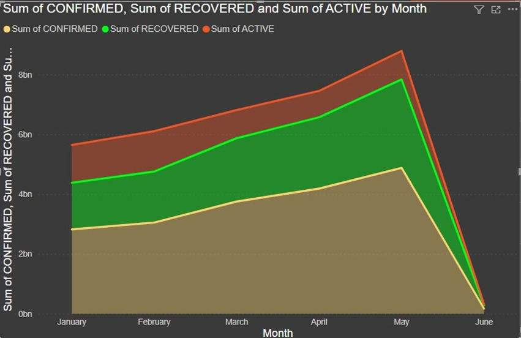

<!-- # NetSocket -->

<!-- 

 -->

# PandemicPulse

## Overview

#### Pandemic Pulse: Data-driven Healthcare Optimization

Project Description: CSSE Covid19 Daily Reports - Healthcare Case Study

Project Overview:
In response to the global Covid-19 pandemic, healthcare management has emerged as a critical area of focus. Leveraging data science methodologies, this project aims to extract meaningful insights from the vast repository of Covid-19 data provided by the Center for Systems Science and Engineering (CSSE) at Johns Hopkins University. Specifically, the project targets patient length of stay as a crucial parameter for enhancing healthcare efficiency within hospital settings.

Problem Statement:
The Covid-19 pandemic has underscored the importance of effective healthcare management. Understanding and predicting patient length of stay is essential for optimizing healthcare operations. This project seeks to address this challenge by employing data science techniques to analyze and interpret the extensive Covid-19 dataset provided by CSSE.

Dataset:
The dataset comprises historical and current Covid-19 data, spanning from January 2nd, 2021 to June 1st, 2021. It includes various attributes such as FIPS codes, county names, confirmed cases, deaths, recoveries, and more. The dataset is sourced from the CSSE GitHub repository and is available in CSV format.

Project Development Steps:

Database and Schema Creation: Establishes the 'Covid_db' database and 'covid_schema' schema to organize the project data effectively.

File Format Creation: Defines a file format for the CSV data to facilitate seamless data loading and processing.

Historical Data Processing:
Creates the 'COVID_HISTORY' table for storing historical data.
Loads historical data into the table and performs clustering to enhance query performance.

Current Data Loading:
Sets up an external stage to store current data from an AWS S3 bucket.
Integrates storage and creates the 'COVID_CURRENT' table for current data.
Establishes a snowpipe for continuous data loading from the external stage to the staging table.

Change Data Capture (CDC) and Slowly Changing Dimension (SCD) Implementation:
Creates a stream ('covid_stream') to capture data changes in the 'COVID_CURRENT' table.
Implements a task to append streamed data to the 'COVID_HISTORY' table, enabling historical tracking.

Data Sharing:
Sets up reader accounts to facilitate data sharing with non-Snowflake users, ensuring accessibility and collaboration.
Time Travel and Zero Copy Cloning:
Utilizes zero-copy cloning to create a clone of the table for historical data analysis.
Implements Snowflake Time Travel to access historical data snapshots for analysis and backup purposes.

Stored Procedure Creation: Develops a stored procedure in JavaScript to insert data into tables, ensuring data integrity and consistency.

Data Visualization:
Creates tables for easy data visualization, including populations, initial confirmed cases, final Covid status, etc.
Utilizes PowerBI for generating insightful visualizations and dashboards to address key business queries.
Business Queries and Visualizations:

## Screenshots

  

  

1.Daily number of confirmed cases in May for India.

  

2.Countries with the highest number of confirmed cases per capita.

  

3.Regions experiencing the most rapid increase in confirmed cases.

  

4.Trend analysis of confirmed, active, and recovered cases by month.

  

## Contributions 

## Contributors 

-  [Jivin Varghese Porthukaran](https://jivin.co.in/) 
   
   
